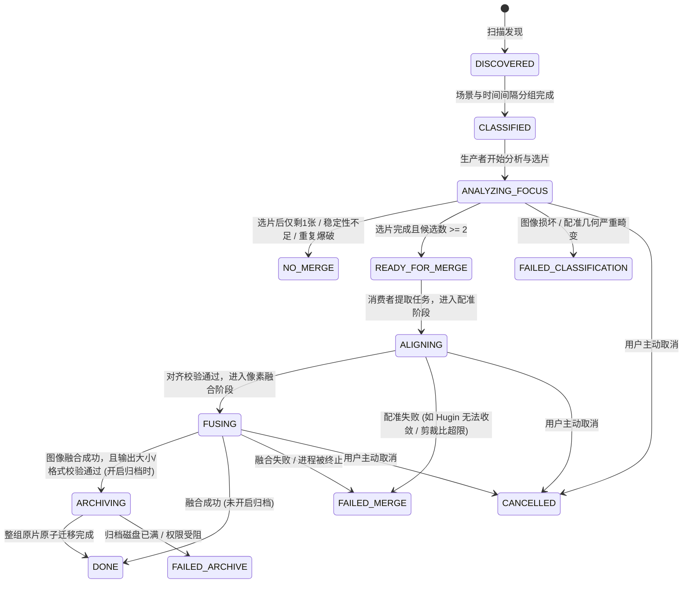
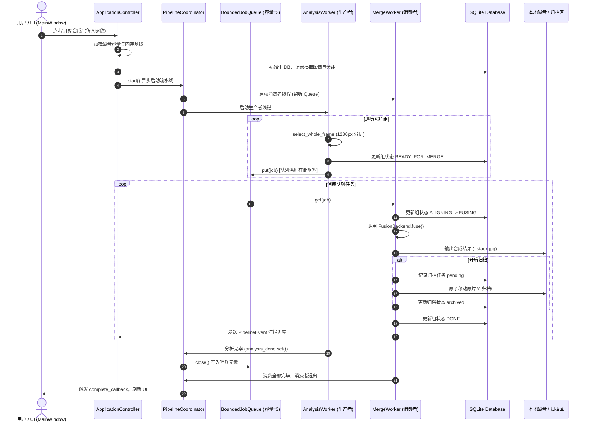

# Focus Stack Assistant 完整技术文档

---

## 1. 项目概述与设计定位

### 1.1 项目背景与解决的问题
**Focus Stack Assistant（景深合成辅助工具）** 是一款专为高倍率微距、微距堆栈摄影及工业光学检测打造的现代化桌面软件与自动化图像处理系统。在微距摄影中，由于光学衍射和物理景深极浅（常在亚毫米级），摄影师通常采用**焦点包围曝光（Focus Bracketing）**技术拍摄数十至数百张焦点依次渐进的照片序列。

然而，传统的焦点堆栈工具和工作流通常面临以下核心技术瓶颈：
1. **内存暴涨与 OOM 崩溃**：数十张 4500万~6100万像素（8K 分辨率）的无损/高质量 JPEG 或 TIFF 照片同时加载到内存进行配准与融合，常导致瞬间数十 GB 内存占用，极易引发操作系统 OOM 杀进程。
2. **边缘碎块与高频假纹理（Artifacts）**：传统拉普拉斯金字塔多频带融合（Multiband Blending）在主体与背景交界处（尤其是中性灰齿尖、黑色金属杆、高反光边缘）容易出现光晕（Halos）、双影、伪边缘和马赛克状离散标签碎块。
3. **相机微位移与视差失真**：微距对焦过程中镜头呼吸效应（Breathing）及对焦导轨移动会带来尺度渐变与轻微透视畸变，若配准顺序错误，误差将沿链条雪崩式放大。
4. **长耗时批处理缺乏容灾与恢复机制**：上千张照片的处理耗时数小时，中间任何单组出错或系统断电均可能导致整个批次报废，甚至损坏原片。

### 1.2 核心设计目标
Focus Stack Assistant 针对上述痛点进行了深度重构与算法攻关，确立了以下工程准则：
- **常数级内存开销（Bounded Memory Footprint）**：无论单组照片数量是 5 张还是 200 张，通过滑动窗口预加载、流式分析、两趟式前缀对齐缓存与就地标签计算，将单次融合的内存峰值严格控制在用户预算内。
- **极致的边沿保真度与色调一致性**：首创**全分辨率灰色边沿标签稳定化（Neutral Edge Stabilization）**与**凸组合窄缝融合（Narrow-Seam Blending）**，杜绝金属锯齿、边缘重影与背景噪点闪烁。
- **全流程崩溃安全与原图绝不损坏**：严格实行**两阶段提交式归档（Two-Phase Archiving）**。只有在合成图像完全生成、大小校验合法且格式验证通过后，才允许触碰源照片；融合失败时原片绝对保持原位。
- **现代化架构与双合成引擎**：默认搭载无需任何外部依赖的**高质量全内存后端（`QualityFusionBackend`）**，同时保留并深度优化了调用 Hugin 工具链的**实验性后端（`HuginEnfuseBackend`）**，两者无缝共用上游元数据扫描、场景检测与智能选片。

### 1.3 技术栈全景
| 领域 | 选型 | 版本/规范 | 选型原因与关键用途 |
| :--- | :--- | :--- | :--- |
| **基础运行环境** | Python | >= 3.11 | 利用高性能类型系统、改进的异常追溯与 GC 效率 |
| **图形用户界面** | PySide6 (Qt for Python) | Qt 6.x | 跨平台现代化 GUI、自适应暗黑主题、异步信号槽解耦 |
| **计算机视觉与矩阵计算** | OpenCV (`cv2`) | >= 4.8.0 | 高性能 ECC 配准、Lanczos4 透视变换、Laplacian 滤波、连通域分析 |
| **数值计算** | NumPy | >= 1.24.0 | 紧凑型 uint8/uint16/float16 多维张量运算、向量化掩模逻辑 |
| **图像底层 I/O 与编码** | Pillow (`PIL`) | >= 10.0.0 | 高质量 JPEG (100% 质量, 4:4:4 采样) 与无损 TIFF 读写、EXIF 提取 |
| **硬件与内存监控** | psutil | >= 5.9.0 | 实时探查物理空闲内存与系统负载，作为并发水位守卫核心依据 |
| **持久化存储** | SQLite3 | 内置 (WAL 模式) | 零依赖持久化项目状态、任务队列、图像元数据、分析缓存图与归档日志 |
| **外部可选工具链** | Hugin / Enfuse | 外部独立程序 | 驱动实验模式下的 `align_image_stack` 与 `enfuse` 工具链 |

---

## 2. 系统总体架构与设计模式

### 2.1 整体分层架构

系统遵循严格的分层松耦合设计，自顶向下划分为 UI 表现层、控制器与编排层、核心视觉算法层、图像融合引擎层、存储与持久化层、文件安全归档层及底层基础工具库。

```
┌────────────────────────────────────────────────────────────────────────┐
│                        UI 表现层 (focus_stack_app.ui)                    │
│      MainWindow (主窗口)  │  GroupListWidget (分组列表)  │  ProgressPanel │
└────────────────────────────────────┬───────────────────────────────────┘
                                     │ (Qt 信号槽 / _SignalBridge)
┌────────────────────────────────────▼───────────────────────────────────┐
│                    控制器与流程编排 (focus_stack_app.pipeline)            │
│                       ApplicationController                            │
│                                    │                                   │
│                        PipelineCoordinator                             │
│                     ┌──────────────┴──────────────┐                    │
│                     ▼                             ▼                    │
│           AnalysisWorker (生产者)        MergeWorker (消费者线程池)      │
│                     │                             ▲                    │
│                     └─────► BoundedJobQueue ──────┘                    │
└────────────────────────────────────┬───────────────────────────────────┘
                                     │
┌────────────────────────────────────▼───────────────────────────────────┐
│                     核心算法层 (focus_stack_app.core)                    │
│  Scanner ──► SceneDetector ──► GroupDetector ──► GroupAnalyzer         │
│                                                         │              │
│  ┌──────────────────────────────────────────────────────┴───────────┐  │
│  │ WholeFrameSelection (智能选片)  │  AlignmentOrder (最佳配准序规划)     │  │
│  │ Registration (分层 ECC 配准)    │  FocusMap / Quality (清晰度评价)   │  │
│  └───────────────────────────────────────────────────────────────────┘  │
└────────────────────────────────────┬───────────────────────────────────┘
                                     │
┌────────────────────────────────────▼───────────────────────────────────┐
│                     融合后端层 (focus_stack_app.fusion)                  │
│                        StackMergeService (分发服务)                     │
│                     ┌──────────────┴──────────────┐                    │
│                     ▼                             ▼                    │
│         QualityFusionBackend (默认)       HuginEnfuseBackend (实验)     │
│         ├── AlignedFrameCache             ├── HuginLocator             │
│         ├── build_focus_labels            ├── AlignImageStack (4级降级)│
│         ├── stabilize_neutral_labels      ├── AlignedTIFFImageCache    │
│         └── blend_focus_pyramid           └── Enfuser                  │
└───────────────────────┬──────────────────────────────────┬─────────────┘
                        │                                  │
┌───────────────────────▼───────┐          ┌───────────────▼─────────────┐
│ 存储层 (focus_stack_app.storage) │          │ 文件层 (focus_stack_app.files)│
│  Database (SQLite + WAL)      │          │  FileArchiver (两阶段归档)    │
│  ManifestWriter (CSV / JSON)  │          │  CollisionResolver (冲突策略) │
│  DiskCache & PlanCache        │          │  output_encoder (安全输出编码)│
└───────────────────────────────┘          └─────────────────────────────┘
```

### 2.2 核心设计模式

1. **生产者-消费者模式 (Producer-Consumer with Bounded Queue)**：
   - 由单线程 `AnalysisWorker` 负责 CPU/内存密集度适中的轻量级分析（缩小至 1280px 进行场景确认、质量评分、ECC 粗对齐与选片）。
   - 将分析完的决策结构（`AnalysisJob`）推入 `BoundedJobQueue`（默认容量 3）。
   - 由 `MergeWorker` 线程池（默认 3 个，配置范围 1～6 个消费者）监听并消费任务，执行全分辨率图像的重度融合。有界队列阻止待合成任务无限积压在内存中。
2. **策略模式 (Strategy Pattern)**：
   - 抽象基类 `FusionBackend` 定义统一接口 `fuse(group, analysis, output_path, work_dir, output_config, cancel_event) -> FusionResult`。
   - `QualityFusionBackend` 与 `HuginEnfuseBackend` 互为独立策略实现，上游 `StackMergeService` 根据配置动态派发，绝不在运行期静默降级或混用。
3. **两阶段提交与补偿归档 (Two-Phase Commit Archiver)**：
   - 原图归档前，必须在 SQLite `archive_operations` 表中记录状态为 `pending`。
   - 目标路径写入、验证成功且源路径安全清理后，状态原子更新为 `archived`。系统重启或崩溃后可快速比对未完成的归档操作并安全恢复。
4. **滑动窗口并发控制 (Sliding-Window Concurrency)**：
   - 图像批处理中采用 `_ordered_bounded_map`，使得同时在内存中解码和运算的未来对象（`Future`）数量严格等于 Worker 并发数，禁止一次性将整组照片提交到线程池。

### 2.3 状态机与任务生命周期

系统对每一组照片（`SceneGroup`）定义了严格的状态机流转，所有状态同步持久化在 SQLite `groups` 表与导出的清单文件中：



---

## 3. 核心视觉算法深度解析

### 3.1 元数据扫描与场景切分 (Scanner & Scene/Group Detector)

#### 时间与文件名自然排序
- 相机拍摄的照片通常具有逻辑连贯性，但在多卡并发或文件名跨千（如 `DSC09999.JPG` -> `DSC00001.JPG`）时，简单字典序会产生混乱。
- 系统使用 `natural_sort_key` 实现类似操作系统的自然数字排序，并通过 `PIL.ExifTags` 深度提取 EXIF 中的 `DateTimeOriginal` 与 `SubsecTimeOriginal`，解析出微秒级精确时间戳。

#### 场景相似度判定
在进入耗时的全尺寸分析前，系统首先在 `core/scene_detector.py` 中以最长边 512 像素生成紧凑特征 `SceneFeature`：
1. **降采样高斯平滑**：消除高频噪点。
2. **三通道量化直方图 (Color Histogram)**：计算前后两帧的巴氏距离或相关系数。
3. **感知哈希 (pHash/dHash)**：生成 64 位离散余弦哈希位串。
4. **低频结构相似度 (Low-Frequency SSIM / Blur Similarity)**：
   $$\text{Similarity}(I_1, I_2) = \frac{2 \mu_1 \mu_2 + C_1}{\mu_1^2 + \mu_2^2 + C_1}$$
   默认阈值 `scene_similarity_threshold = 0.82`。若由于景深推进导致局部虚化剧烈改变，算法引入 `scene_confirmation_window = 2` 的滑动确认窗口，防止因连续两张虚实变化过大而误切断同一景深组。

#### 物理拍摄暂停截断
在 `core/group_detector.py` 中，依据真实拍摄习惯引入时间间隔截断参数 `grouping_pause_seconds`（默认 20 秒，可在 UI 调整 1~3600 秒）。若相邻两张照片的拍摄时间差超过该阈值，即使画面极其相似，也被强制划分为新的独立拍摄组。对于少于 `minimum_stack_group_size`（默认 4 张）的组，标记为 `NO_MERGE` 或单张跳过。

### 3.2 智能选片与焦点覆盖算法 (Whole Frame Selection)

在实际拍摄的 50 张照片中，往往存在焦点重叠、无效焦平面甚至相机微震导致的模糊片。若全量合成，不仅速度极慢，还会将模糊帧的噪声引入结果。`core/whole_frame_selection.py` 实现了全局覆盖优化算法：

```
[输入全组照片 (1280px)]
         │
         ▼
[全画幅清晰度初筛] ──► 剔除主体发生转面或明显位移的废片
         │
         ▼
[确定全局参考基准 (Anchor)] ──► 选取全图平均清晰度最高的帧作为第 0 坐标系
         │
         ▼
[粗到精仿射 ECC 配准] ──► 计算每张图相对于 Anchor 的 2×3 仿射变换矩阵
         │
         ▼
[计算配准后焦点图 (Focus Maps)] ──► 每像素取 Laplacian 能量
         │
         ▼
[贪婪最大覆盖迭代 (Greedy Max-Coverage)]
   ├── 统计全景深最佳清晰度包络：Best(x, y) = max_i Focus_i(x, y)
   ├── 生成每帧的有效清晰区域掩模：Mask_i = Focus_i >= 0.90 * Best
   └── 循环贪婪挑选：每次选取对当前未覆盖区域贡献增益最大的帧
         │
         ▼ (当单帧边际增益 < 0.05% 或总覆盖率 >= 99.95% 时截止)
[输出最终选片集合 (selected_indices)]
```

- **全图焦点响应度计算**：
  $$S(x, y) = G_{\sigma=2.0} * \left( \nabla^2(G_{\sigma=0.6} * I_{\text{gray}}) \right)^2$$
- **仿射 ECC 金字塔粗精配准**：
  采用三级高斯尺度金字塔（Scale 0.5 高斯模糊核 9 -> Scale 1.0 核 7 -> Scale 1.0 核 3），在逆向变换下最大化增强相关系数（Enhanced Correlation Coefficient）。
  配准有效性校验：相关系数必须 $\ge 0.90$，且变换矩阵奇异值分解（SVD）求得的几何缩放必须在 $[0.8, 1.25]$ 区间内，否则触发配准拒绝。

### 3.3 最优配准传播路径规划 (Alignment Order Planning)

在 `core/alignment_order.py` 中，针对 Hugin 外部工具和长序列堆栈，直接以第 1 张为基准向后累加会导致**误差漂移（Drift）**。
1. **配准图（Registration Graph）构建**：在缩小预览图上计算任意两帧之间的重叠度、尺度偏离度与重投影残差，生成每条边的代价：
   $$\text{Cost} = (1 - \text{Confidence}) + 0.25 \cdot \text{Residual} + 0.30 \cdot |\ln \text{Scale}| + 0.30 \cdot (1 - \text{Overlap})$$
2. **图中心元（Medoid）发现**：找出与所有其他帧联通性最好、平均置信度最高的一帧作为全局中心参考帧 `preview_reference`。
3. **最小生成树 / 局部集线器（Local Hubs）遍历**：当照片数大于 40 时，启用局部相邻连边加中枢枢纽（Hubs）稀疏图架构，求出最优遍历序列 `alignment_order`，保证输入给对齐引擎的帧序列相邻变形最小。

### 3.4 焦点标签构建与背景抗噪 (Focus Labels & Stable Background)

在全尺寸融合阶段，系统首先需要为每个像素决策：**该像素应由第几张输入图贡献？** 该矩阵称为焦点标签（`labels: uint16`）。

#### 支持域膨胀 (Support Dilation)
在边缘过渡区，由于散焦弥散圆（CoC）扩散，失焦边缘的光晕区域在失焦帧中可能表现出比清晰帧更强的高频梯度。为防止模糊边缘在背景处错误“胜出”，算法引入支持域膨胀：
```python
# focus_masks.py
response = cv2.GaussianBlur(lap * lap, (0, 0), 4.0)
diameter = 2 * focus_support_radius + 1  # 默认 radius=7, 直径 15
dilated_response = cv2.dilate(response, np.ones((diameter, diameter), np.uint8))
```
通过向外扩展清晰特征的有效支持半径，强制将边缘处的光晕归属权授予清晰帧。

#### 平坦无纹理背景锁定 (`_StableBackground`)
在纯白背景、无纹理阴影或纯色衬底处，由于缺乏有效光学反差，各帧在此处的 Laplacian 响应完全是相机传感器的高斯热噪点。如果直接按清晰度得分逐像素比较，背景区域的标签将呈现斑驳交错的雪花状跳跃，最终导致合成图背景出现色块断层。
- **解决方案**：算法维护一个全局细节累积掩模 `detail`。通过自适应噪声百分位数提取阈值，如果某个连通域面积超过总像素的 0.2% 且全波段均无有效纹理和色彩反差（Chroma $\le 40$），则判定为平坦背景。
- **亮度锚定**：计算所有输入帧的灰度均值，将该背景区域的标签强行锁定为**最接近中位数曝光的那单单一帧**。背景因此纯净平滑，完全消除噪点闪烁。

### 3.5 灰色边沿标签稳定化算法 (Neutral Edge Stabilization)

#### 问题本质
在微距机械零件、钟表齿轮、黑色金属杆等主体中，边缘通常呈现高对比度灰度变化（如灰白或黑白切面），而缺乏色度信息。在全分辨率计算时，局部极其微小的亚像素位移会导致边缘处的焦点标签在多张图之间剧烈振荡（例如齿尖 5 个像素内交替出现来自第 2、5、8 帧的切片），造成锯齿状的边缘断裂与“双边缘/重影”。

#### 核心数学原理与工程实现
`fusion/quality_fusion.py` 中的 `stabilize_neutral_labels` 采取了一种优雅而零信息损失的算法：
1. **中性区域判定**：
   在基准参考帧中检测低彩度且非过曝的像素：
   $$\text{Chroma}(x, y) = \max(R, G, B) - \min(R, G, B)$$
   $$\text{NeutralMask}(x, y) = (I_{\text{gray}} < 235) \land (\text{Chroma} < 65)$$
2. **空间中值标签过滤**：
   利用 15×15 结构元对标签图做空间中值滤波：
   $$\text{Labels}_{\text{median}} = \text{medianBlur}(\text{Labels}, k=15)$$
3. **选择性标签替换**：
   $$\text{Labels}_{\text{stable}}(x, y) = \begin{cases} \text{Labels}_{\text{median}}(x, y), & \text{if } \text{NeutralMask}(x, y) = \text{True} \\ \text{Labels}(x, y), & \text{otherwise} \end{cases}$$

> [!IMPORTANT]
> **关键设计考量**：
> 该中值滤波**作用于整数标签空间（Labels Array）**，绝不对原始 RGB 像素数据执行任何 15 像素模糊！它仅消除了标签孤岛，最终合成时每个像素依然 100% 提取自原图对应位置的清晰像素，边缘锐度丝毫不减，而锯齿碎块完全消失。

### 3.6 窄缝融合与金字塔混合 (Narrow-Seam Blending)

在 `fusion/focus_masks.py` 的 `blend_focus_pyramid` 中，默认采用 `levels=1` 的凸组合混合。

#### 为什么弃用传统多频带拉普拉斯融合？
传统 Enfuse 或多层拉普拉斯金字塔在融合时，将图像分解为低频（底色基底）和多层高频（细节残差）。当清晰前景与虚化背景相邻时，虚化帧在低频层的大光斑能量会渗入高频细节层，最终导致在黑背景上产生一圈明显的黑晕（Dark Rim）或在亮背景上产生刺眼的白边（Halos）。

#### 单像素羽化窄缝过渡 (1-Pixel Feathering)
为了在无光晕的同时避免产生类似硬拼接的拼接线，系统对标签边界做约 1 像素的高斯羽化：
$$W_i(x, y) = G_{\sigma=1.0} * (\mathbb{I}(\text{Labels}(x, y) = i))$$
$$I_{\text{composite}}(x, y) = \sum_{i=0}^{N-1} I_i^{\text{aligned}}(x, y) \cdot W_i(x, y)$$
由于羽化仅在 1 像素尺度内平滑，各帧的加权总和恒为 1（凸组合），数学上严格保证了边缘无光晕、无溢出、无过冲。

---

## 4. 双融合后端系统详解

Focus Stack Assistant 在合成阶段提供了两条独立且互为补充的后端实现：

| 关键特性 | 高质量合成（默认）`QualityFusionBackend` | 实验模式 `HuginEnfuseBackend` |
| :--- | :--- | :--- |
| **外部程序依赖** | **完全零依赖**（纯 Python + OpenCV + NumPy） | 需要 `align_image_stack` 与 `enfuse` |
| **对齐机制** | 内存单应性透视变换（`warpPerspective` + `Lanczos4`） | 外部生成全尺寸中间 TIFF 序列 |
| **对齐缓存** | `AlignedFrameCache`（两趟扫描内存复用） | `AlignedTIFFImageCache`（磁盘 TIFF 缓存） |
| **中间文件落地** | **全程无磁盘临时 TIFF**，直接生成最终 JPG/TIFF | 磁盘写入各级对齐尝试目录及中间蒙版 |
| **边缘处理** | 焦点标签空间中值平滑 + 单像素羽化窄缝融合 | Enfuse 多频带融合（可自适应层数） |
| **适用场景** | 默认推荐、大批量快速处理、常规对焦环微调 | 存在大视差、镜头严重桶形畸变或外部工具研究 |

### 4.1 高质量原生后端 (`QualityFusionBackend`)

#### 执行全流程
1. **坐标系尺度换算 (`scaled_matrix`)**：
   在分析阶段，ECC 配准是在缩小预览图（如 1280px）上计算的 $3\times3$ 单应矩阵。融合时，通过对角缩放矩阵 $S_{\text{src}}$ 与 $S_{\text{target}}$ 将其无损映射至原图物理像素坐标系：
   $$M_{\text{full}} = S_{\text{target}} \cdot M_{\text{preview}} \cdot S_{\text{src}}^{-1}$$
2. **两趟式前缀对齐缓存 (`AlignedFrameCache`)**：
   - 传统做法：先将所有对齐图全部生成并存入列表（内存瞬间爆炸成百 GB）。
   - 本后端设计：定义懒加载函数 `load_aligned(index)`，按需调用 OpenCV 进行全图对齐。
   - `AlignedFrameCache` 实时探查物理空闲内存，设定缓存上限（默认 1GB）。在第 1 趟计算焦点标签时，能装入多少张就缓存多少张；在第 2 趟像素融合时，缓存命中的直接弹出并释放，超出部分重新按需解码对齐。
3. **异常恢复配准重算**：
   若任务是从旧版数据库或断点恢复，缺失原始预览图尺寸元数据时，后端会自动在 640px 预览图上就地重新配准；若配准失败立刻中止报错，绝不将错误矩阵强行套用至全分辨率大图。

### 4.2 实验性 Hugin/Enfuse 后端 (`HuginEnfuseBackend`)

#### 外部工具定位器 (`HuginLocator`)
在 `hugin/hugin_locator.py` 中，程序按照以下严格的优先级链自动发现可执行文件：
1. 代码显式参数传入的路径。
2. 操作系统环境变量：`HUGIN_BIN`、`HUGIN_PATH`、`HUGIN_HOME`。
3. 项目根目录自带运行时：`.runtime-deps/hugin/bin`。
4. 系统环境变量 `PATH`。
5. Windows 平台常用默认安装目录（如 `C:\Program Files\Hugin\bin` 等）。

#### 渐进式四级对齐降级策略 (4-Level Retry Alignment)
对焦堆栈常因视场变化过大导致 `align_image_stack` 默认参数崩溃。后端设计了 4 级自动重试：
- **Level 1**：默认优化视野与缩放，自动裁剪匹配边框。
- **Level 2**：加入相关系数阈值控制 `--corr=0.8`。
- **Level 3**：开启径向畸变修正 `-d --corr=0.8`。
- **Level 4**：开启中心偏移与光学畸变全优化 `-d --corr=0.8` 且 `optimize_centre=True`。

#### 对齐有效性几何守卫 (`_validate_alignment`)
外部工具执行完成后，后端对生成的 TIFF 序列进行严密的几何度量：
- **裁剪比（Crop Ratio）安全检查**：
  $$\text{CropRatio} = \frac{\text{Width}_{\text{aligned}} \times \text{Height}_{\text{aligned}}}{\text{Width}_{\text{anchor}} \times \text{Height}_{\text{anchor}}}$$
  - 若 $\text{CropRatio} < 0.35$ 或 $> 1.75$：判定为对齐严重畸变发散，强制抛出 `AlignmentError` 触发重试。
  - 若 $\text{CropRatio} < 0.65$：记录警告并在日志与清单中标记 `CROP_RATIO_WARNING`。
- **主体色彩与转面一致性检查**：
  提取对齐图的颜色主体蒙版 `colour_subject_mask`。若相邻帧主体形状突变超过阈值，判定存在被摄物体转动或镜头晃动，阻断错误合成。

---

## 5. 流水线并发编排与内存保护

### 5.1 生产者-消费者流控模型

`focus_stack_app/pipeline/coordinator.py` 管理整个处理流水线的生命周期：



### 5.2 资源自适应水位与内存守卫 (`MemoryGuard`)

1. **自适应分析并发数 (`resolve_focus_analysis_budget`)**：
   在分析阶段，并发解码多张 1280px 照片需要消耗 CPU 和内存。系统探查 `psutil.virtual_memory()`：
   - 预留系统安全底线：$\text{Reserve} = \max(2\,\text{GB}, 0.10 \times \text{TotalMemory})$。
   - 可用动态预算：$\text{Spare} = \max(0, \text{AvailableMemory} - \text{Reserve})$。
   - 根据单张分析预估内存（约 150MB）计算有效并发工作线程数（限制在 1~10 之间）。
2. **OpenCV 全局线程数钳制 (`opencv_thread_budget`)**：
   OpenCV 默认会占满全部 CPU 逻辑核心。在多组或多帧并发分析时，这会导致极严重的线程上下文切换开销。系统动态将 `cv2.setNumThreads` 钳制为合理配额（通常 1~4），实现吞吐量最大化。

### 5.3 取消信号传递与优雅停机

- 整个系统由根 `threading.Event`（即 `cancel_event`）驱动。
- 当用户在 UI 点击“取消”时，`cancel_event.set()` 被置位。
- 信号迅速渗透至 `BoundedJobQueue`（立即唤醒阻塞的生产者和消费者）、OpenCV 内部迭代循环、以及外部进程包装器 `process.py`（立即向 `align_image_stack` 发送 `SIGTERM` / `TerminateProcess`）。
- 正在进行中的未完成合成组会被安全回滚，临时目录被保留以供诊断，而不会输出半截损坏的文件。

---

## 6. 持久化存储与断点恢复系统

### 6.1 SQLite 数据表全景设计

数据库文件默认保存在 `输出目录/.stack_cache/database.sqlite`，启用 WAL（Write-Ahead Logging）模式与 `PRAGMA busy_timeout = 30000`，支持高并发读写。

```
                              ┌──────────────────┐
                              │   schema_meta    │
                              ├──────────────────┤
                              │ key (PK)         │
                              │ value            │
                              └──────────────────┘

┌────────────────────────┐         ┌────────────────────────┐
│         groups         │ 1     * │         images         │
├────────────────────────┼─────────┼────────────────────────┤
│ id (INTEGER PK)        │◄────────┤ id (INTEGER PK)        │
│ first_image_id (FK)────┼────────►│ group_id (FK)          │
│ image_count            │         │ original_path (UNIQUE) │
│ selected_count         │         │ current_path           │
│ status                 │         │ capture_time           │
│ output_path            │         │ sequence_index         │
│ preview_reference      │         │ status                 │
│ requested_backend      │         │ archive_operation_id   │
│ actual_backend         │         └───────────┬────────────┘
│ crop_ratio             │                     │ 1
│ diagnostics            │                     │
└───────────┬────────────┘                     │
            │ 1                                │ 1
            │                                  ▼
            │ *                      ┌────────────────────────┐
┌───────────▼────────────┐           │   archive_operations   │
│          jobs          │           ├────────────────────────┤
├────────────────────────┤           │ operation_id (TEXT PK) │
│ id (INTEGER PK)        │           │ image_id (FK)          │
│ group_id (FK)          │           │ source_path            │
│ stage                  │           │ destination_path       │
│ progress               │           │ mode                   │
│ status                 │           │ status (pending/done)  │
│ error                  │           │ bytes_transferred      │
└────────────────────────┘           └────────────────────────┘
```

此外还包含核心分析表 `analysis`（记录单张的变换矩阵、场景哈希与清晰度得分）与 `cached_plans`（持久化选片与定序计算图）。

### 6.2 计算图缓存 (`PlanCache`)

在 `core/plan_cache.py` 中，智能选片与配准定序的计算结果被高度结构化缓存：
- 缓存键由算法语义版本（如 `selection-plan-v1`）、输入文件绝对路径列表、配置哈希计算而成。
- 当用户二次运行同一组照片，或者软件中途重启恢复时，直接读取 `cached_plans`，**耗时瞬间从数分钟降至 0 秒**，彻底跳过重复解码。

### 6.3 审计清单输出 (`stack_manifest.csv`)

每组合成完成后，`storage/manifest.py` 会原子更新输出目录下的 `stack_manifest.csv`。清单包含 23 个标准化字段，供工业检测与摄影师回溯：
`group_id`, `first_image`, `image`, `selected`, `selection_reason`, `quality_score`, `coverage_gain`, `group_coverage`, `merge_output`, `status`, `capture_order`, `alignment_order`, `actual_hugin_input_order`, `alignment_order_confidence`, `preview_reference`, `fusion_backend`, `requested_backend`, `actual_backend`, `alignment_level`, `alignment_status`, `crop_ratio`, `fallback_used`, `diagnostics`。

---

## 7. 文件管理、冲突处理与安全归档

### 7.1 输出文件命名与防覆盖约束
- 输出目录默认为源目录下的 `合成/` 文件夹。
- 命名规则严格遵循：**以整组第一张原片的文件名为主干**，若输出格式为 JPG，附加 `_stack.jpg`（如 `DSC03003.JPG` -> `DSC03003_stack.jpg`）；若输出格式为 TIFF，则命名为对应主干 `.tif`。
- **物理防冲撞安全红线**：
  1. 输出路径绝对禁止等于任何一张输入照片的路径。
  2. 若目标合成文件已存在，除非在配置中显式声明 `overwrite=True`，否则程序抛出 `OutputCollisionError` 并拒绝执行，绝不静默覆盖已有成果。

### 7.2 两阶段事务性归档机制 (`FileArchiver`)
归档功能由用户选项显式开启（默认关闭以确保首选安全）。当 `archive_enabled=True` 时：
1. **成功后置**：合成工作未全部完成或输出文件小于有效阈值（128字节）时，归档逻辑严禁被调用。
2. **跨平台目录锁 (`_destination_lock`)**：所有工作线程在向同一归档文件夹移动文件时，通过物理路径规范化键共享线程锁，保证文件名判定与文件系统移动原子化。
3. **命名冲突解决策略 (`CollisionPolicy`)**：
   当归档目标目录已存在同名原片时，支持根据策略自动重命名：
   - `SUFFIX`：追加序号（如 `DSC03003_1.JPG`）。
   - `TIMESTAMP`：追加精确时间戳。
   - `SKIP` 或 `FAIL`：保留在原地并报错。

---

## 8. 图形用户界面与人机交互设计

### 8.1 响应式 Qt 架构与 `_SignalBridge`

GUI 采用 PySide6 构建，设计遵循**主线程零阻塞原则**。
- `MainWindow` 不执行任何图像解码、数据库写入或外部进程调用。
- 所有控制逻辑由后台线程的 `ApplicationController` 执行。
- 后台事件（如 `PipelineEvent`）通过线程安全的 Qt 信号桥（`_SignalBridge.event`）打包投递至主事件循环（Event Loop），界面帧率稳定保持在 60 FPS。

### 8.2 界面布局与交互视觉规范

```
┌───────────────────────────────────────────────────────────────────────────┐
│ Focus Stack  /  景深合成                                         [ 就绪 ] │
├───────────────────────────────┬───────────────────────────────────────────┤
│ [控制面板 - 左侧固定 340px]     │ [照片分组与处理进度 - 右侧自适应]          │
│                               │                                           │
│ 源照片目录: [浏览...]          │ 总体进度: [========================] 75%  │
│ D:/Photos/Macro_2026          │ 当前状态: 正在合成第 3 组 (FUSING)         │
│                               │                                           │
│ 合成输出目录: [浏览...]        │ ┌───────────────────────────────────────┐ │
│ D:/Photos/Macro_2026/合成      │ │ 组 1: DSC03003 (共15张, 选出8张) [完成]│ │
│                               │ │ ├─ DSC03003_stack.jpg (已生成)        │ │
│ 合成模式: [高质量合成 (推荐) ▼]│ ├───────────────────────────────────────┤ │
│ 拍摄暂停阈值: [  20 ] 秒       │ │ 组 2: DSC03018 (共22张, 选出11张)[完成]│ │
│ 最小合成张数: [   4 ] 张       │ ├───────────────────────────────────────┤ │
│ 输出格式:     [ JPG 100%    ▼]│ │ 组 3: DSC03040 (共18张)        [配准中]│ │
│                               │ │ └─ 正在进行全分辨率 Lanczos4 变换...   │ │
│ [ ] 递归子目录扫描            │ └───────────────────────────────────────┘ │
│ [ ] 开启原图自动归档          │                                           │
│                               │                                           │
│ [   开 始 合 成   ] [ 取消 ]   │ [ 详细日志输出区...                     ] │
└───────────────────────────────┴───────────────────────────────────────────┘
```

- **视觉风格**：采用现代化深色专业工作区主题（深灰背景 `#1e1e1e`、面板 `#252526`、高亮强调色蓝色 `#0e639c`、文字浅灰 `#cccccc`）。
- **实时监控面板 (`ProgressPanel`)**：分层展示阶段（扫描 -> 分组 -> 分析 -> 配准 -> 融合 -> 归档）、总完成比例、剩余预估时间与失败诊断徽章。

---

## 9. 核心配置模型与参数映射

系统的全部运行参数均被严格类型化收敛在 `focus_stack_app/config.py` 中的 `AppConfig` 实体中，支持通过 JSON 无缝导入导出：

| 配置块 | 参数字段 | 默认值 | 作用域与合法取值说明 |
| :--- | :--- | :--- | :--- |
| **`analysis`** | `scene_preview_long_edge` | `512` | 场景切分与直方图分析的分辨率长边 |
| | `focus_analysis_long_edge` | `1600` | 焦点图清晰度分析长边 |
| | `scene_similarity_threshold`| `0.82` | 相邻帧判定为同一场景的最低相似度 |
| | `duplicate_focus_threshold` | `0.995`| 判定两张图焦平面完全重复的距离阈值 |
| | `minimum_stack_group_size` | `4` | 允许执行合成的每组最小照片数量 |
| | `coverage_target` | `0.995`| 智能选片目标景深覆盖率 |
| | `min_coverage_gain` | `0.002`| 选片时单帧必须带来的最低清晰区域增益 |
| **`output`** | `format` | `"jpg"`| 输出格式：`"jpg"`, `"jpeg"`, `"tif"`, `"tiff"` |
| | `jpeg_quality` | `100` | JPG 编码品质（1~100） |
| | `jpeg_subsampling` | `0` | 色度抽样：`0` (4:4:4 无损色度), `1` (4:2:2), `2` (4:2:0) |
| | `output_suffix` | `"_stack"` | 结果文件名后缀（针对 JPG） |
| | `overwrite` | `False` | 是否允许覆盖已有同名合成文件（默认严格禁止） |
| **`runtime`** | `fusion_backend` | `"quality"` | 选用后端：`"quality"` 或 `"hugin_enfuse"` |
| | `min_available_memory_bytes`| `2 GiB` | 系统维持运转所需保留的物理内存下限 |
| | `opencv_aligned_cache_bytes`| `1 GiB` | 高质量模式下对齐帧内存缓存上限 |
| | `crop_ratio_fail` | `0.35` | 实验模式判定对齐发散失败的有效面积下限 |
| | `crop_ratio_warning` | `0.65` | 触发剪裁比过大警告的阈值 |
| **`scanner`** | `extensions` | `(".jpg", ".jpeg")` | 扫描接收的照片扩展名元组 |
| | `recursive` | `False` | 是否递归深度遍历子文件夹 |
| | `include_hidden` | `False` | 是否包含操作系统隐藏文件 |

### 历史兼容与别名规范化 (`fusion_modes.py`)
为了兼容旧配置文件与早期 UI 选项，系统集中在 `focus_stack_app/fusion_modes.py` 中进行映射：
- 别名 `fast`、`opencv`、`standard` $\longrightarrow$ 严格映射为规范名 `quality`。
- 别名 `hugin`、`experimental` $\longrightarrow$ 严格映射为规范名 `hugin_enfuse`。

---

## 10. 故障诊断、测试体系与工程维护

### 10.1 典型故障排查指南

| 故障现象 | 常见原因分析 | 推荐排查与解决步骤 |
| :--- | :--- | :--- |
| **合成结果在灰色齿尖/金属杆处出现锯齿或重影** | 1. 未启用中性边缘稳定算法；<br>2. 拍摄过程中微距导轨晃动造成严重视差失真。 | 1. 检查是否使用默认高质量模式；<br>2. 查看日志中是否存在 `NEUTRAL_EDGE_COHERENCE` 诊断记录；<br>3. 检查原片主体是否发生明显立体旋转。 |
| **实验模式提示 `HuginToolNotFound`** | 操作系统未安装 Hugin，或可执行文件路径未加入环境变量。 | 1. 在 PowerShell 执行 `$env:HUGIN_BIN="D:\Program Files\Hugin\bin"`；<br>2. 或直接在 UI 设置面板中指定 Hugin 绝对路径；<br>3. 推荐切换回无需任何依赖的高质量默认模式。 |
| **合成结果报告 `ALIGNMENT_LEVEL_X_FAILED`** | Hugin 特征点匹配因景深过浅发散，裁剪比超出安全限制。 | 查看输出目录保留的 `temp/alignment_level_X` 临时文件夹，检查控制点日志；可通过调整对齐顺序或改用高质量模式直接避开。 |
| **整组被标记为 `NO_MERGE` 并跳过** | 1. 组内照片数小于阈值（默认4张）；<br>2. 经过智能选片后，有效清晰片仅剩 1 张；<br>3. 相邻帧结构相似度过低。 | 1. 在界面将“最小合成张数”调低为 2 或 3；<br>2. 检查该组是否属于快速动作抓拍而非景深包围序列。 |
| **提示 `OutputCollisionError`** | 输出目录下已存在同名合成文件，或输出路径与原片路径冲突。 | 1. 检查是否重复处理了同一批照片；<br>2. 如需重新生成，需先手动移除旧结果或在配置中勾选允许覆盖。 |

### 10.2 自动化测试套件

项目在 `tests/` 目录下建立了完备的工业级自动化测试，共计 35 个测试套件，全面涵盖逻辑单元与并发压力测试：

```powershell
# 运行高质量模式与算法核心测试
pytest -q tests/test_quality_fusion.py tests/test_quality_cache.py tests/test_fusion_backends.py

# 运行流水线并发与恢复测试
pytest -q tests/test_pipeline_app.py tests/test_pipeline_recovery.py tests/test_archiver_concurrency.py

# 运行千级大批量压力测试
pytest -q tests/test_stress_1000.py
```

- **`test_quality_fusion.py`**：测试全尺寸输出维度、灰色边沿稳定化、彩色边缘保护、标签中值滤波边界效应及多格式编码。
- **`test_pipeline_recovery.py`**：模拟流水线在分析阶段、融合阶段中途被强行中断（Crash），验证重启后 SQLite 状态重建与孤儿文件隔离。
- **`test_archiver_concurrency.py`**：多线程并发归档压测，验证目标目录原子锁与无损坏重命名策略。

---

## 11. 总结与演进路线

Focus Stack Assistant 通过优雅的架构设计，成功化解了微距景深合成中**超高分辨率图像吞吐与内存极限约束**之间的尖锐矛盾。其核心创新点在于：
1. **纯内存单应透视对齐与流式处理**：彻底告别低效的大体量中间 TIFF 读写。
2. **标签级中性边缘稳定化算法**：以极小的计算代价精准消除了困扰摄影师的微距金属重影与边缘碎块。
3. **安全闭环的生命周期与事务归档**：从数学证明与工程实践双重维度确保了摄影师资产绝对安全。

未来版本可继续探索 GPU（CUDA/DirectML）硬件加速透视变换与多平面光流（Optical Flow）局部畸变补偿，进一步拓展超大景深工业级微距摄影的极致画质。
