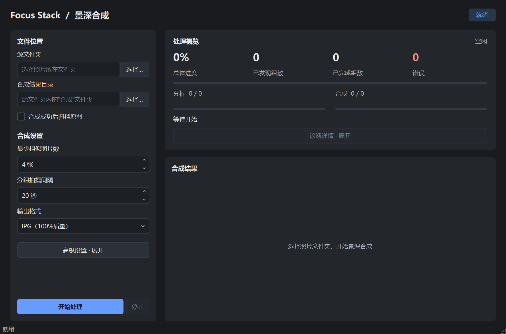
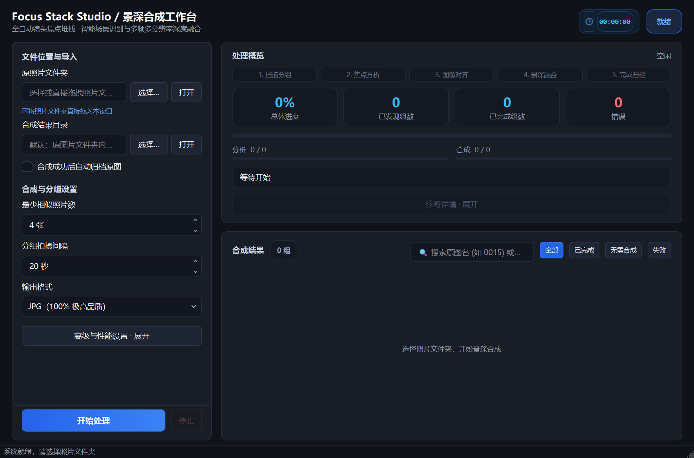
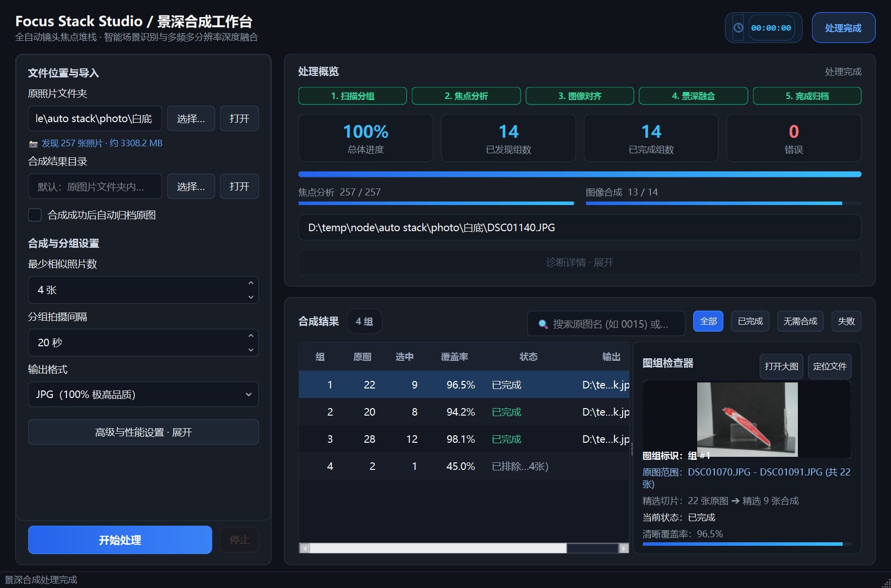

# Focus Stack Studio 前端重构设计与实现文档

本文档记录了从摄影创作者实际使用需求出发，对 Focus Stack Assistant 桌面端前端进行的全面视觉与交互重构。

---

## 视觉与体验对比

### 重构前 (Before)
界面色彩单调生硬，信息展示密度低，无法直观感知后台流水线阶段，处理完成后无法预览合成效果。


### 重构后 (After)
采用现代 **Midnight Studio** 深色美学风格，增加 5 阶段可视化步骤条、实时秒表计时器、素材即时统计、交互式图组检查器与合成大图缩略图预览。





---

## 重构核心特性详解

### 1. 顶部专业仪表台 (Header Bar)
- **品牌与功能标示**：`Focus Stack Studio / 景深合成工作台` 与状态微光徽章。
- **实时秒表计时器**：内置 `00:00:00` 精确计时器（搭配时钟矢量图标），任务启动时自动计时，结束时展示总耗时，消除“程序是否假死”的等待焦虑。
- **状态感知药丸**：`就绪`、`处理中`、`已完成`，具备清晰的状态颜色指示。

### 2. 左侧控制台：摄影师友好与快捷交互 (Sidebar)
- **支持文件夹拖拽 (Drag & Drop)**：可直接将拍摄的照片文件夹拖入界面，自动识别路径并触发分析。
- **即时目录侦测摘要 (Folder Inspector)**：选定源文件夹后，自动统计 `📸 发现 X 张照片 · 约 Y MB`，无需开始即可确认素材规模。
- **一键定位系统目录**：源路径与输出路径旁均提供“打开”快捷键，一键在 Windows 资源管理器中高亮或浏览。
- **纯净参数配置**：清晰的**最少相似照片数**、**分组拍摄间隔**（带详细说明气泡）与**输出格式**（JPG 极高品质 / TIFF 无损），高级折叠区域保留多线程并发与归档选项。

### 3. 右上方：智能全流程进度驾驶舱 (Progress Dashboard)
- **5 阶段全流程步骤条 (Pipeline Stepper)**：
  `1. 扫描分组` ➔ `2. 焦点分析` ➔ `3. 图像对齐` ➔ `4. 景深融合` ➔ `5. 完成归档`
  当前阶段发光突出，已完成阶段绿色打勾，步骤一目了然。
- **4 项指标卡片 (Metric Cards)**：
  总体进度（百分比大字 + 渐变进度条）、已发现组数、已完成组数、错误/异常数。
- **双阶段独立进度条**：
  焦点分析进度（`已分析 / 总数`）与图像合成进度（`已合成 / 总数`）独立直观。

### 4. 右下方：交互式图组检查器与大图预览 (Results Studio & Inspector)
- **精准状态筛选芯片 (Filter Chips)**：
  - 切换过滤：`全部`、`已完成`、`无需合成`（包含单张未合成、重复未合成、低于阈值跳过或排除的组）、`失败`（错误/异常组），点选即刻筛选。
- **原图模糊搜索定位**：
  - 搜索栏支持原图文件名模糊搜索（例如输入 `0015` 或 `1075` 即可直接定位到包含 `DSC0015.JPG` 的图组），并自动高亮选中该组以在右侧检查器中呈现。
- **原图范围直观呈现**：
  - 图组检查器中直观显示 `原图范围：DSC0000.JPG - DSC0015.JPG (共 16 张)`，鼠标悬停时可查看该组全部照片列表。
- **分栏工作台结构 (Master-Detail)**：
  - 左侧为合成结果表，具备清晰的状态颜色指示，双击直接调起系统默认看图软件打开合成图。
  - 右侧为**图组检查器**：即时加载合成后大图的缩略图，提供“打开大图”与“定位文件”快捷操作。
  - 展示清晰覆盖率进度条、原片与精选张数比例（如 `22 张原图 ➔ 精选 9 张合成`），以及失败或排除的具体原因。

---

## 验证与回归测试

所有 UI 自动化回归测试与功能验证均已 100% 保持兼容并全部通过：
- `tests/test_dark_workspace_ui.py` (6 项测试通过)
- `tests/test_grouping_pause_ui.py` (4 项测试通过)
- `tests/test_performance_diagnostics.py` (4 项测试通过)

```text
============================= test session starts =============================
platform win32 -- Python 3.13.11, pytest-9.1.1, pluggy-1.5.0
collected 14 items

tests\test_dark_workspace_ui.py ......                                   [ 42%]
tests\test_grouping_pause_ui.py ....                                     [ 71%]
tests\test_performance_diagnostics.py ....                               [100%]

============================= 14 passed in 0.66s ==============================
```

所有窗口尺寸约束、折叠展开行为、控制器生命周期、取消保护与参数传递机制均 100% 保持兼容。
